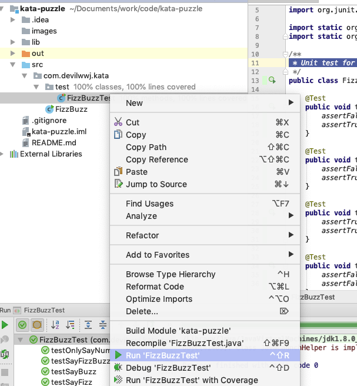
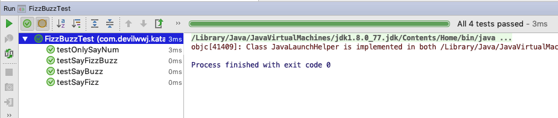

# kata-puzzle
learn how to write unit test code.

[TOC]

说明：本工程由Intellij创建，打开通过import方式导入，单元测试框架采用JUnit.

## 00.FizzBuzz单元测试说明

### 源代码

```Java
public class FizzBuzz {


    public static void sayNumberGame(int firstNum, int secondNum) {
        // 从1~100报数
        for (int i = 1; i <= 100; i++) {
            // 即是第一个特殊数字的倍数又是第二个数字的倍数说FizzBuzz
            if (isMultipleNum(firstNum, i) && isMultipleNum(secondNum, i)) {
                System.out.println(String.format("%s Don't Say number, but say FizzBuzz", i));
                continue;
            }

            // 第一个特殊数字的倍数说Fizz
            if (isMultipleNum(firstNum, i)) {
                System.out.println(String.format("%d is a multiple of %d or contains %d Say Fizz", i, firstNum, firstNum));
                continue;
            }

            // 第二个特殊数字的倍数说Buzz
            if (isMultipleNum(secondNum, i)) {
                System.out.println(String.format("%d is a multiple of %d or contains %d Say Buzz", i, secondNum, secondNum));
                continue;
            }

            // 不满足以上所有条件
            System.out.println(String.format("%s Say number", i));
        }
    }

    public static boolean isMultipleNum(int targetNum, int sayNum) {
        String targetNumStr = String.valueOf(targetNum);
        String sayNumStr = String.valueOf(sayNum);
        return sayNum % targetNum == 0 || sayNumStr.contains(targetNumStr);
    }

    public static void main(String[] args) {
        System.out.println("00.FizzBuzz!!!");
        sayNumberGame(3, 5);
    }
}

```

### 测试用例

```java

public class FizzBuzzTest {

    @Test
    public void testSayFizz() {
        assertFalse(FizzBuzz.isMultipleNum(2, 3));
        assertTrue(FizzBuzz.isMultipleNum(3, 3));
    }

    @Test
    public void testSayBuzz() {
        assertFalse(FizzBuzz.isMultipleNum(4, 5));
        assertTrue(FizzBuzz.isMultipleNum(5, 5));
    }

    @Test
    public void testSayFizzBuzz() {
        assertTrue(FizzBuzz.isMultipleNum(3, 15));
        assertTrue(FizzBuzz.isMultipleNum(5, 15));
    }

    @Test
    public void testOnlySayNum() {
        assertFalse(FizzBuzz.isMultipleNum(2, 3));
        assertFalse(FizzBuzz.isMultipleNum(2, 5));
    }

}

```

运行单元测试



查看单元测试结果




